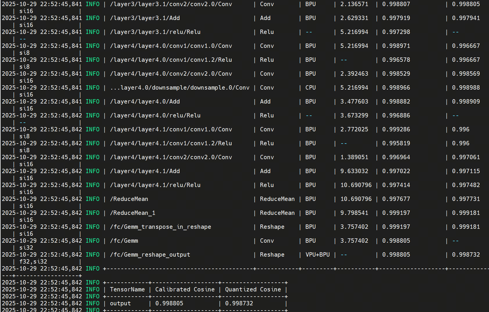

# 1. 模型简介


众所周知，ResNet残差网络是在图像分类上的良好应用。但很多时候，我们不仅仅要分类图像，而是需要对视频进行分类。

视频的分类往往需要模型接收一整个视频作为输入，这样的话，ResNet中的2D卷积核往往不太够用，故因此引入3D卷积核。

3D卷积方法是将视频划分成多个固定长度的片段（clip），与2D卷积相比，3D卷积能够提取连续帧之间的运动信息。这是通过将视频的多帧进行融合来实现的，使得模型能够更好地理解视频中的时空特征。

以C3D（3D Convolutional Networks）为例，C3D是一种使用3D卷积处理视频数据的深度学习模型。它通过将3×3卷积扩展到3×3×3卷积，2×2汇合扩展到2×2×2汇合，来提取视频中的时空特征。实验表明，C3D在处理视频分类、动作识别等任务时取得了显著的效果。

在C3D中，卷积核大小、步长和零填充等参数的设置对模型的性能有着重要影响。例如，通过对比实验发现，时域方向卷积核大小为3时效果最好。此外，C3D还采用了多个卷积层和池化层来构建深层[网络](https://cloud.baidu.com/product/et.html)结构，以提取更丰富的特征。

而本次模型则是聚焦在R3D-18中，3D ResNet-18 (R3D-18) 是一个专为视频理解任务设计的深度学习模型，它通过引入三维卷积核，将经典图像识别模型ResNet-18成功扩展至时空领域。与处理静态图像的2D卷积不同，其3D卷积操作能同时在视频帧的空间维度（高度和宽度）与时间维度上直接提取特征，从而有效捕捉物体运动与动作演变等时序信息。该模型保留了ResNet的核心思想——残差连接，这确保了网络在达到18层深度时仍能稳定训练，避免了梯度消失问题。通常，模型接收一个由16帧组成的短片片段（如112x112像素），并输出在大型数据集（如Kinetics-400，包含400种人类动作）上预测的动作类别概率。因其在识别准确率与计算效率之间取得了良好平衡，R3D-18成为视频动作识别领域中一个广泛采用的基础模型。


# 2. ONNX模型

我们将R3D-18模型进行ONNX导出，并观察其包含的算子。


其模型接收一个视频输入，输出400个类别的概率，进行模型推理时，与常规ResNet类似，我们选取最大概率的类别做为最终的推理结果。可以看到虽然算子名字都较为常规，且模型结构基本为残差结构，但每一个Conv卷积算子都是3D卷积，均为5D，例如其中之一的卷积核尺寸为512x512x3x3x3。这样会导致虽然模型本身不深，但每一层包含的算子参数较多，模型本身依旧很大。


# 3. 模型量化

对于模型量化，我们选用S100/S100P算法工具链OpenExplorer 3.5.0。

我们使用如下命令：

```plain&#x20;text
hb_compile --fast-perf --march nash-e --model r3d_18_orig.onnx
```

随后得到报错：


该报错指出虽然工具链支持Conv3D算子的转换，但并不支持GlobalAveragePooling的3D操作。因此为了转换3D卷积模型，我们需要对池化算子Pooling进行替换。下图为替换前的3D池化算子


我们将其替换为2D的ReduceMean算子：


再次进行工具链的转换，得到如下结果：



可以看到大部分算子量化精度均大于0.99，最终量化精度\~0.99

# 4. RDK S100模型部署

## 4.1 模型上板精度

为了测试精度，我们选用视频archery.mp4进行测试，以下是该视频的截图之一：


视频内容即运动员在进行射箭的操作。

我们将视频存为npy格式的numpy数组，随后作为输入让r3d\_18.hbm模型进行推理。推理后由大到小打印Top5最大概率的类别，它们依次是：


可以看到Top1概率的类别为Archery，即射箭。证实在该测试用例中，量化后的模型精度没有太大问题。

## 4.2 模型上板性能

在完成工具链的步骤后，我们得到.hbm格式的模型，该格式为可以在RDK S100上部署的异构模型，支持使用BPU算力。

我们使用hrt\_model\_exec工具进行模型性能测试。

```plain&#x20;text
hrt_model_exec perf --model_file r3d_18.hbm --frame_count 100 --thread_num 1
```

我们使用参数thread\_num来调整线程数，得到不同的结果

最终得到如下表格：

| 线程数 | 总帧数 | 总时延（ms）  | 平均时延（ms） | FPS   |
| --- | --- | -------- | -------- | ----- |
| 1   | 100 | 18267.76 | 182.68   | 5.47  |
| 2   | 100 | 18291.76 | 182.93   | 10.82 |
| 4   | 100 | 18501.06 | 185.03   | 21.07 |
| 8   | 100 | 24743.56 | 249.19   | 30.74 |

我们使用命令：

```plain&#x20;text
hrt_ucp_monitor
```

得到其他指标


BPU占用率：5.2%

ION内存占用：\~91.9M

带宽读：\~533

带宽写：\~304

## 4.3 模型上板操作

为了体验该模型，在操作该模型前，请参考RDK S100的Model Zoo的README

在RDK S100板卡上下载并安装hbm\_runtime，

随后，我们安装对应的依赖：

```plain&#x20;text
pip install -r requirements.txt
```

在完成相关依赖的安装后，我们可以执行

```plain&#x20;text
python main.py
```

得到以上Top5最大概率的类别，
